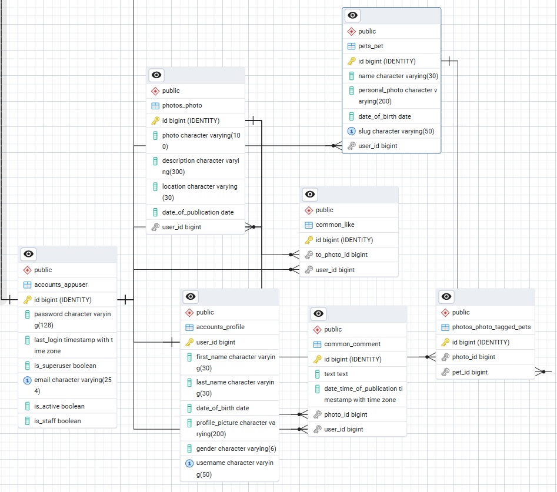

# Technical Documentation - Petstagram

## Architecture Overview

Petstagram is built using the **Django Web Framework**, following the **Model-Template-View (MTV)** architecture.

- **Models**
- **Templates**
- **Views**

## Application Modules

### 1. Accounts (`accounts/`)
Handles user identity and profile information.
- **Custom User Model (`AppUser`)**: Inherits from `AbstractBaseUser`. Uses `email` as the unique identifier instead of a username.
- **Profile Model**: Stores additional user metadata (first name, last name, DOB, etc.) and is linked to `AppUser` via a One-to-One relationship.
- **Managers**: Includes a custom manager for `AppUser` to handle user creation properly with email.

### 2. Pets (`pets/`)
Manages pet-related data.
- **Pet Model**: Stores pet details including name, personal photo, and date of birth.
- **Slug Generation**: Uses a custom `save` method to generate unique slugs based on the pet's name and ID for SEO-friendly URLs.

### 3. Photos (`photos/`)
Manages the core content of the platform.
- **Photo Model**: Stores uploaded images, descriptions, and locations.
- **Tagged Pets**: A Many-to-Many relationship with the `Pet` model, allowing multiple pets to be tagged in a single photo.
- **Validators**: Implements a `FileSizeValidator` to restrict photo uploads to a maximum of 5MB.

### 4. Common (`common/`)
Handles cross-cutting features and global interactions.
- **Index View**: A class-based view (`ListView`) that displays the home feed with pagination (2 photos per page).
- **Like Model**: Tracks photo likes by users.
- **Comment Model**: Stores user comments on photos.
- **Search**: Implements a search form to filter the photo feed by pet name.

## Database Schema (ERD)

## Key Business Logic

### Authentication Flow
The project uses `Django's` built-in authentication system but overrides the default user model. `LoginRequiredMixin` and `PermissionDenied` exceptions are used across views to ensure that only authorized users can modify or delete content (profiles, pets, photos).

### Feed Logic
The `IndexView` in `common/views.py` performs complex queries using:
- `prefetch_related`: To optimize database hits for tagged pets.
- `annotate`: To calculate `likes_count` on the fly.
- `Exists` with `OuterRef`: To efficiently check if the currently logged-in user has liked a specific photo without additional queries per item.

### Performance Optimizations
- **Select Related / Prefetch Related**: Used in `ProfileDetailsView` and `PetDetailsView` to minimize "N+1" query problems when fetching related pets, photos, and likes.
- **Pagination**: Implemented on the home page to manage loading times as the content grows.

## Media Handling
- User-uploaded images are stored in the `media/images/` directory.
- `Pillow` is used for image validation and processing.
- The `FileSizeValidator` ensures server storage isn't overwhelmed by excessively large files.

## URL Structure
- `/accounts/`: Registration, Login, Profile Management.
- `/pets/`: Adding and viewing pet details.
- `/photos/`: Photo management (add, edit, delete).
- `/`: Home page and social interactions (likes, comments).
