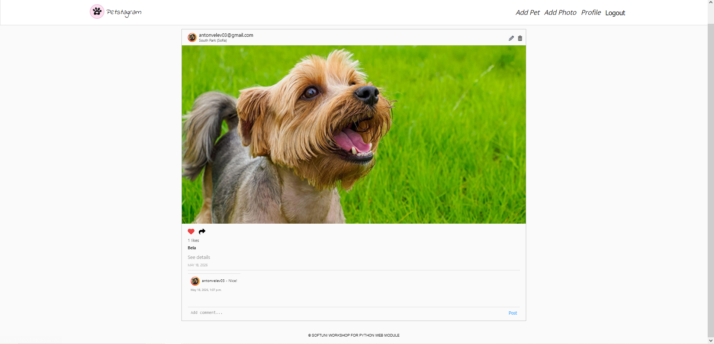
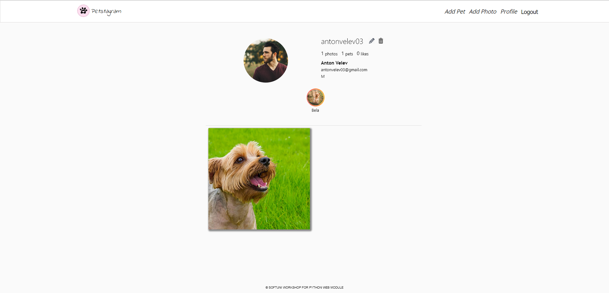

# Petstagram

Petstagram is a social media platform designed for pet owners and animal lovers. It allows users to create profiles for themselves and their pets, share photos, tag pets in photos, and interact with the community through likes and comments.

[📖 View Full Project Documentation here](./DOCUMENTATION.md)

 

### Profile details
 


## Features

- **User Accounts**:
  - Secure registration and login using email.
  - Custom user profiles with personal information and profile pictures.
  - Profile management (edit and delete).
- **Pet Management**:
  - Create and manage individual profiles for multiple pets.
  - Automatic slug generation for pet URLs.
- **Photo Sharing**:
  - Upload photos with descriptions and location tags.
  - Tag specific pets in shared photos.
  - Edit and delete shared content.
- **Social Interactions**:
  - Like/Unlike photos to show appreciation.
  - Comment on photos to engage with other users.
  - Share links to photos via clipboard functionality.
- **Search & Discovery**:
  - Home feed featuring all shared pet photos.
  - Search functionality to find photos by pet name.
  - Paginated browsing for better performance.

## Tech Stack

- **Backend**: Django 5.2.10
- **Database**: PostgreSQL
- **Image Processing**: Pillow
- **Environment Management**: python-dotenv
- **Frontend**: Django Templates, Vanilla CSS

## Installation and Setup

### Prerequisites

- Python 3.x
- PostgreSQL database

### Steps

1. **Clone the repository**:
   ```bash
   git clone <repository-url>
   cd Petstagram
   ```

2. **Create and activate a virtual environment**:
   ```bash
   python -m venv .venv
   # On Windows:
   .venv\Scripts\activate
   # On macOS/Linux:
   source .venv/bin/activate
   ```

3. **Install dependencies**:
   ```bash
   pip install -r requirements.txt
   ```

4. **Configure Environment Variables**:
   Create a `.env` file in the root directory and add the following:
   ```env
   SECRET_KEY=your_secret_key
   NAME=your_db_name
   USER=your_db_user
   PASSWORD=your_db_password
   EMAIL_HOST_USER=your_email
   EMAIL_HOST_PASSWORD=your_app_password
   COMPANY_EMAIL=your_company_email
   ```

5. **Run Migrations**:
   ```bash
   python manage.py migrate
   ```

6. **Start the development server**:
   ```bash
   python manage.py runserver
   ```

7. **Access the application**:
   Open your browser and navigate to `http://127.0.0.1:8000/`.

## Project Structure

- `accounts/`: User authentication and profile logic.
- `pets/`: Pet-related data and views.
- `photos/`: Photo upload and tagging functionality.
- `common/`: Shared views (home page), likes, and comments.
- `templates/`: HTML structures for the entire project.
- `static/`: CSS and image assets.
- `media/`: User-uploaded content (photos).
